# Design Document 

Authors: Giulia D'Ascenzi, Francesco Di Franco, Antonino Monti

Date: 09/06/2021

Version: 3.0 

# Contents

- [High level design](#package-diagram)
- [Low level design](#class-diagram)
- [Verification traceability matrix](#verification-traceability-matrix)
- [Verification sequence diagrams](#verification-sequence-diagrams)

# Instructions

The design must satisfy the Official Requirements document, notably functional and non functional requirements

# High level design 

Since the project is very simple and small, the application is composed of only five packages. The application follows the MVC pattern: the View is implemented in the view package (that contains the GUI), while the Model and Control are implemented in the data, the classes and the exceptions package. The classes package contains the implementation of the classes interfaces defined in the data package.

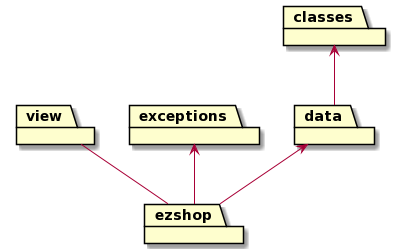

# Low level design

EZShopInterface file (contained in the data package):

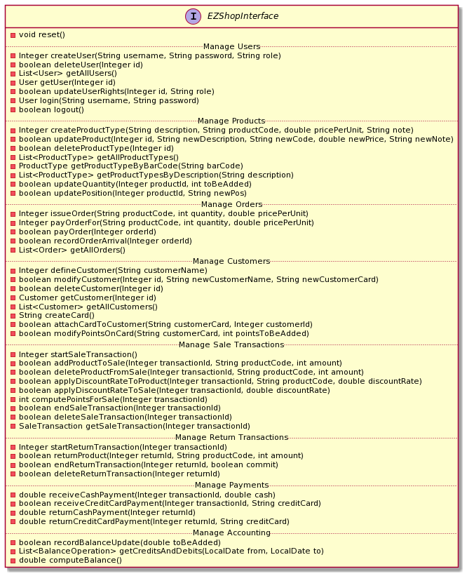

This interface is implemented by the Shop class in the data package, the structure of which is reported below:

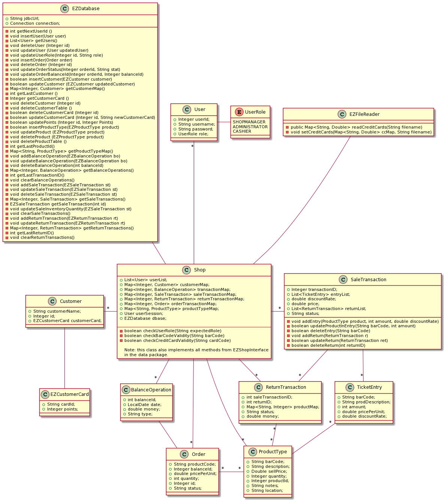

All classes except for EZFileReader are persistent.

# Verification traceability matrix

| Class \ FR        | FR1  | FR3  | FR4  | FR5  | FR6  | FR7  | FR8  |
| ----------------- | :--: | :--: | :--: | :--: | :--: | :--: | :--: |
| Shop              |  X   |  X   |  X   |  X   |  X   |  X   |  X   |
| User              |  X   |      |      |      |      |      |      |
| BalanceOperation  |      |      |  X   |      |  X   |      |  X   |
| ReturnTransaction |      |      |      |      |  X   |      |      |
| Order             |      |      |  X   |      |      |      |      |
| SaleTransaction   |      |      |      |      |  X   |      |      |
| ProductType       |      |  X   |  X   |      |      |      |      |
| TicketEntry       |      |      |      |      |  X   |      |      |
| Customer          |      |      |      |  X   |      |      |      |
| EZCustomerCard    |      |      |      |  X   |      |      |      |
| EZDatabase        |  X   |  X   |  X   |  X   |  X   |  X   |  X   |
| EZFileReader      |      |      |      |      |      |  X   |      |

# Verification sequence diagrams

#### Scenario 1.1: Create product type X

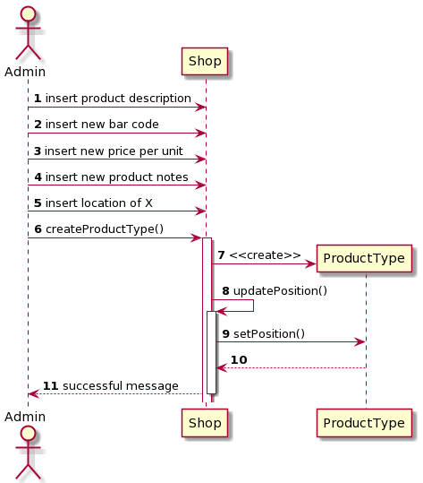

#### Scenario 2.1: Create user and define rights

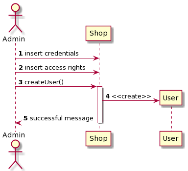

#### Scenario 3.3: Record order of product type X arrival

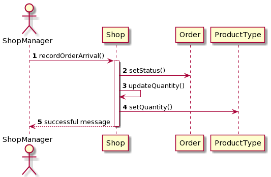

#### Scenario 4.1: Create customer record

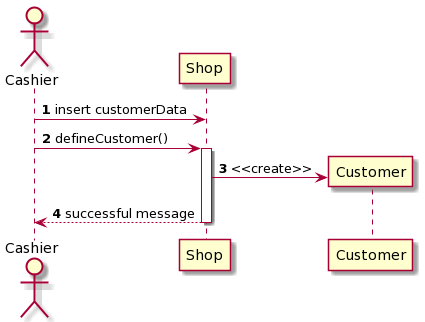

#### Scenario 5.1: Login

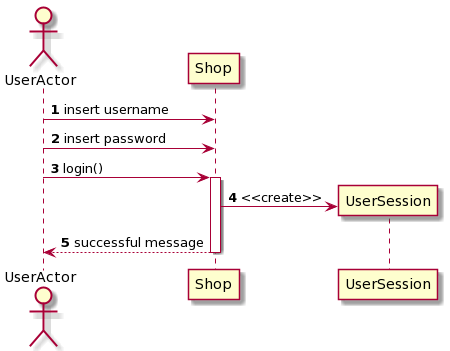

#### Scenario 5.2: Logout

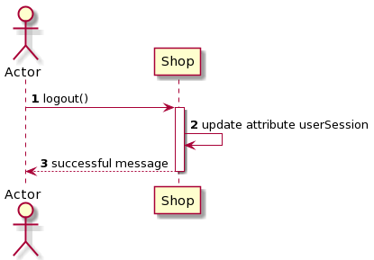

#### Scenario 6.4: Sale of product type X with loyalty card update

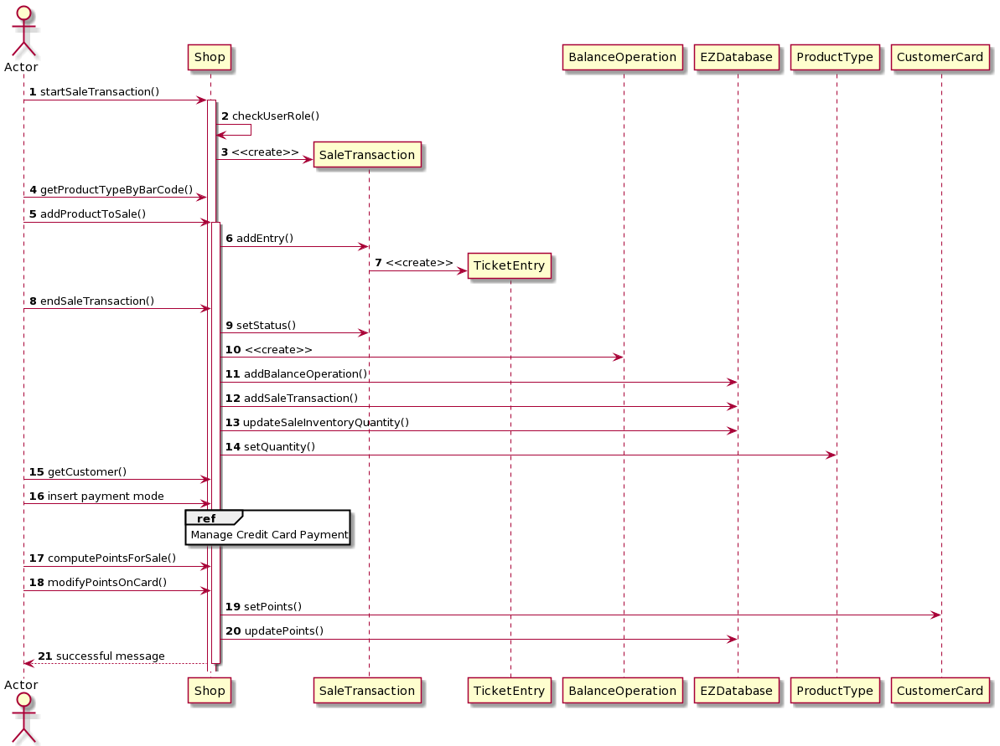

#### Scenario 7.1: Manage payment by valid credit card

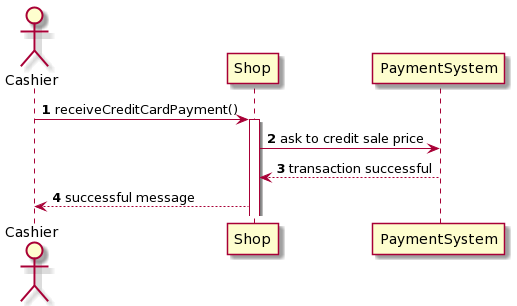

#### Scenario 8.1: Return transaction of product type X completed, credit card

#### Scenario 9.1: List credits and debits

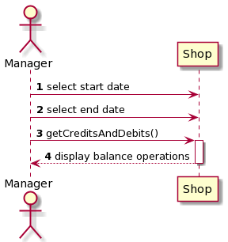

#### Scenario 10.1: Return payment by credit card

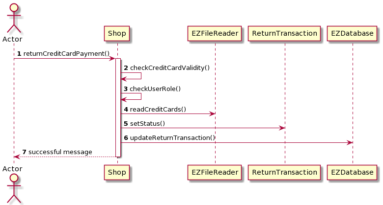

