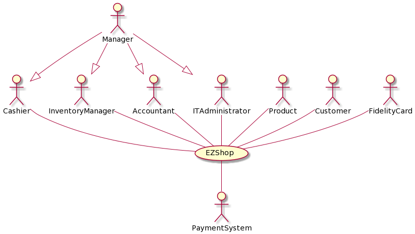
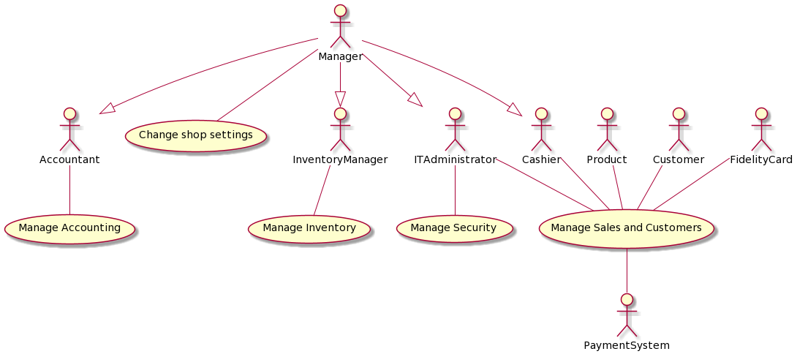
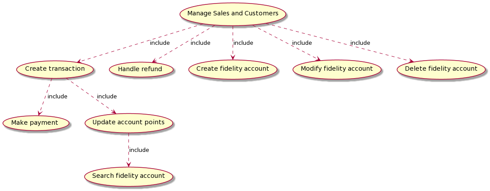
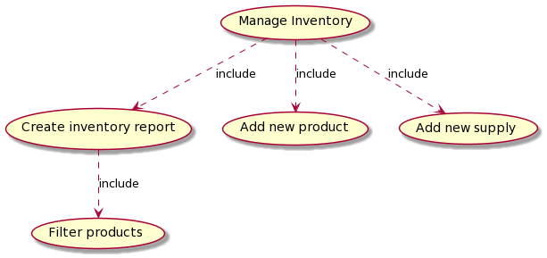
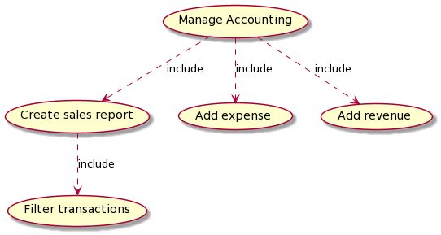
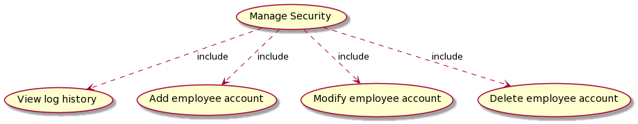
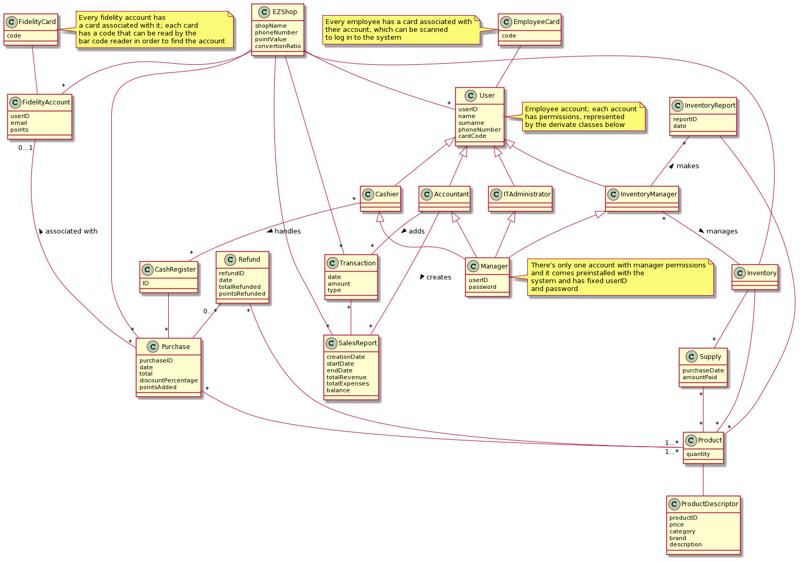
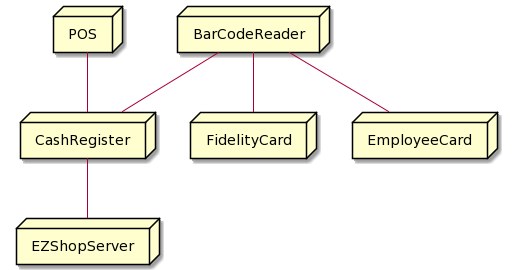
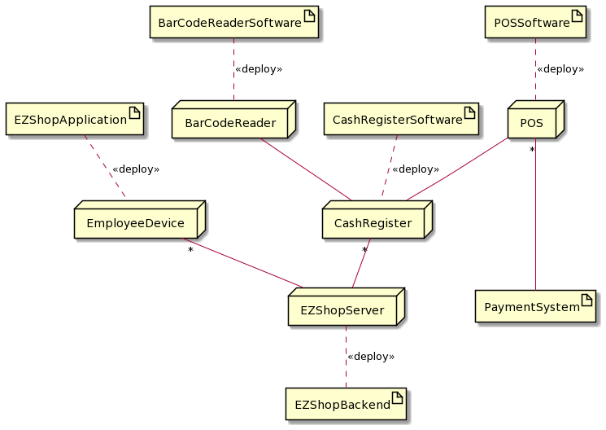

# Requirements Document 

Authors: Giulia D'Ascenzi, Francesco Di Franco, Mahmoud Hassan Ali, Antonino Monti

Date:

Version: 1.0

# Contents

- [Essential description](#essential-description)
- [Stakeholders](#stakeholders)
- [Context Diagram and interfaces](#context-diagram-and-interfaces)
	+ [Context Diagram](#context-diagram)
	+ [Interfaces](#interfaces) 
	
- [Stories and personas](#stories-and-personas)
- [Functional and non functional requirements](#functional-and-non-functional-requirements)
	+ [Functional Requirements](#functional-requirements)
	+ [Non functional requirements](#non-functional-requirements)
- [Use case diagram and use cases](#use-case-diagram-and-use-cases)
	+ [Use case diagram](#use-case-diagram)
	+ [Use cases](#use-cases)
- [Glossary](#glossary)
- [System design](#system-design)
- [Deployment diagram](#deployment-diagram)

# Essential description

Small shops require a simple application to support the owner or manager. A small shop (ex a food shop) occupies 50-200 square meters, sells 500-2000 different item types, has one or a few cash registers 
EZShop is a software application to:

* manage sales
* manage inventory
* manage customers
* support accounting

# Stakeholders

| Stakeholder name  | Description |
| ----------------- |:-----------:|
|   Manager   | Manager of the shop - buys the system |
| Cashier | Cashier who works at the shop; manages cash registers and customer purchases |
| Customer | Regular or occasional customer; does not have a fidelity account |
| Loyal customer | Regular customer who has a fidelity account and collects points for discounts and offers |
| Inventory manager | Shop employee who manages the inventory |
| Supplier | Organization/company contacted by the owner to order supplies |
| Accountant | Employee who manages accounting |
| Payment system | System with which EZShop interacts to process payments |
| Product | Generic product sold by the shop |
| IT Administrator | Employee tasked with maintaining and operating the IT part of the system |
| Fidelity card | Card granted to fidelity customers, identified by a bar code |

# Context Diagram and interfaces

## Context Diagram

## Interfaces

| Actor | Logical Interface | Physical Interface  |
| ------------- |:-------------:| -----:|
|   Manager   | Application GUI | Device |
| Cashier | Application GUI | Cash register |
| Inventory manager | Application GUI | Device |
| Accountant | Application GUI | Device |
| Product | Read the bar code | Bar code reader |
| Payment system | Payment APIs | POS, Device |
| IT Administrator | Application GUI | Device |
| Customer | POS GUI | POS |
| Fidelity card | Read the card | Bar code reader |

For reference:

- Payment APIs: https://rapidapi.com/serg.osipchuk/api/SquareECommerce?endpoint=apiendpoint_c2456e40-f966-11e7-b2fb-5fca152468f2createCustomerCard 

# Stories and personas

Alice is 49 and works as a manager in a small supermarket. She loves to keep everything under control, and for this reason she wants to monitor the working hours of the employees and the financial situation by watching the cash flow anytime, so that she may schedule the shop's future expenses
In order to decide new offers and special discounts of loyal customers and order the sold-out items, Alice also wants to monitor sales by keeping track of the number of purchases and customers.

John is 32 and works as a cashier in a small grocery shop. His job involves interacting with a lot of customers every day, which means he needs to be as efficient as possible in managing the sales, and the best way to achieve that is to use a software product. In particular, he needs the prices of all items to be recorded in the system and to be easy to retrieve, and to have the calculations be accurate and the printing of the receipt to be fast so that the sales process can be precise and take less time from the customers. Furthermore, lately many customers have been asking to pay with their credit card, and since the shop doesn't currently own a system that accepts them he would be more than pleased to have one that does that.

Jack is 39 and works as an inventory manager in a small clothes chop. He needs to track the availability of each item in the shop, to be able to report the shortage of any item to the manager in order to order new quantities of it. He needs to be able to insert new products to the system easily or update the current items in the shop, so that the records will be always up-to-date.

Lisa is 50 and works as an accountant for a small store. Unfortunately, her job can be very taxing as she sometimes spends all night doing accounting calculations. To prevent that from happening, she would like to use a system that monitors the transactions processed by the cashiers in real time and automatically, so she can include them in her financial reports to be delivered to the manager. Thanks to the software, she would also be able to record the expenses and the revenues of the shop in order to include them in the financial records as well and report this to the manager.

Carl is 24, works in a bank opposite a small supermarket. He's a regular customer, and after work he usually spends some time at the market to buy a few things he needs. Even though he's satisfied with the service the shop provides, he wouldn't mind benefitting from occasional discounts for loyal customers.

# Functional and non functional requirements

## Functional Requirements

| ID        | Description  |
| ------------- |:--------------|
|  FR1     | Manage sales |
| - FR1.1 | - Create transaction |
| - - FR1.1.1 | - - Scan products |
| - FR1.2 | - Make payment |
| - - FR1.2.1 | - - Contact payment system |
| - - FR1.2.2 | - - Print receipt |
| - FR1.3 | - Handle refund |
| ... | --- |
|  FR2     | Manage inventory |
| - FR2.1 | - View available supplies |
| - - FR2.1.1 | - - Search and filter products |
| - FR2.2 | - Create inventory report |
| - FR2.3 | - Update inventory |
| - - FR2.3.1 | - - Add new product |
| - - FR2.3.1 | - - Add new supply |
| - FR2.4 | - Filter products |
| ... | --- |
| FR3 | Manage customers |
| - FR3.1 | - Create fidelity account |
| - FR3.2 | - Modify account |
| - FR3.3 | - Delete account |
| - FR3.4 | - Update account points |
| - FR3.5 | - Scan fidelity card |
| ... | --- |
| FR4 | Manage accounting |
| - FR4.1 | - Compute current balance |
| - FR4.2 | - Create sales report |
| - FR4.3 | - Add expense |
| - FR4.4 | - Add revenue |
| ... | --- |
| FR5 | Security management |
| - FR5.1 | - View log history |
| - FR5.2 | - Add employee account |
| - - FR5.2.1 | - - Give permissions |
| - FR5.3 | - Modify employee account |
| - - FR5.3.1 | - - Modify permissions |
| - FR5.4 | - Delete employee account |
| ... | --- |
| FR6 | Change shop settings |

### Access rights, actor vs. function

| Function    | Manager | Accountant | Cashier | Inventory manager | IT Administrator |
| ----------- | ------- | ---------- | ------- | ----------------- | ---------------- |
| FR1         | Yes     | No         | Yes     | No                | No               |
| FR2         | Yes     | No         | No      | Yes               | No               |
| FR3         | Yes     | No         | Yes     | No                | Yes              |
| FR4         | Yes     | Yes        | No      | No                | No               |
| FR5         | Yes     | No         | No      | No                | Yes              |
| FR6         | Yes     | No         | No      | No                | No               |

In short:

- The Accountant can access all functions regarding FR4;
- The Cashier can access all functions regarding FR1 and FR3;
- The Inventory Manager can access all functions regarding FR2;
- The IT Administrator can access all functions regarding FR3 and FR5;
- The Manager can access any function;

## Non Functional Requirements

| ID        | Type (efficiency, reliability, ..)           | Description  | Refers to |
| ------------- |:-------------:| :-----:| -----:|
|  NFR1     | Security | Only authenticated employees may interact with the system | All FR |
|  NFR2     | Efficiency | All functions should execute in <0.5s | All FR |
|  NFR3     | Privacy | The system will never save credit card information | All FR |
| NFR4 | Availability | The system should be available at least 99% of the time | All FR |
| NFR5 | Usability | Any employee should be able to learn how to use the system in about 15 minutes | All FR |

# Use case diagram and use cases

## Use case diagram

## Use cases

### Use case 1, UC1 - Create transaction

| Actors Involved  |                      Cashier                       |
| ---------------- | :----------------------------------------------------------: |
| Precondition     |                              -                               |
| Post condition   |                              Transaction (purchase) T has been added, inventory has been updated, fidelity account A is updated if it exists                               |
| Nominal Scenario | The cashier scans the products, processes the payment and then finalizes the transaction and prints the receipt |
| Variant |  If the customer has a fidelity account, they can decide to convert some points in euros to have a discount; after the payment the account's points are updated as computed in UC11, regardless of whether points were spent or not |
| Variant | If the payment is rejected (e.g. the payment system doesn't respond or rejects the payment, the customer doesn't have enough money, etc.) the transaction is rolled back |

#### Scenario 1.1

| Scenario 1.1 | Nominal scenario |
| -------------- | :----------------------------------------------------------: |
| Precondition   | - |
| Post condition | Transaction (purchase) T has been added, inventory has been updated, fidelity account A (if present) is updated |
| Step#          |                         Description                          |
| 1 | The cashier scans the products with the bar code reader and adds them to a purchase list and eventually modifies each product's quantity |
| 2 | The system computes the total amount and applies eventual discounts |
| 3 | The cashier proceeds to process the payment as computed in UC2 |
| 4 | The transaction is added to the system, the system prints the receipt, the inventory is updated, the customer's fidelity account (if it exists) is updated |

#### Scenario 1.2

| Scenario 1.2 | The customer decides to use points to get a discount |
| -------------- | :----------------------------------------------------------: |
| Precondition   | - |
| Post condition | Transaction (purchase) T has been added, inventory has been updated, fidelity account A is updated |
| Step#          |                         Description                          |
| 1 | The cashier scans the products with the bar code reader and adds them to a purchase list and eventually modifies each product's quantity |
| 2 | The cashier inputs the amount of points the customer wants to convert |
| 3 | The system computes the total amount and applies the discount |
| 4 | The cashier proceeds to process the payment as computed in UC2 |
| 5 | The transaction is added to the system, the system prints the receipt, the inventory is updated, the customer's fidelity account is updated |

### Use case 2, UC2 - Make payment

| Actors Involved  |                      Cashier, Payment system, Customer                       |
| ---------------- | :----------------------------------------------------------: |
| Precondition     | A pending transaction has been created |
| Post condition   | The payment has been processed |
| Nominal Scenario | The cashier inputs the payment method chosen by the customer and processes the payment |
| Variant | The cashier inputs "cash" as the payment method |
| Variant | The cashier inputs "credit card" as the payment method |
| Variant | If the amount of euros to pay is 0 (e.g. the customer pays for everything with only points), the use case isn't executed |

#### Scenario 2.1

| Scenario 2.1   | The customer decides to pay with cash |
| -------------- | :----------------------------------------------------------: |
| Precondition   | A pending transaction has been created |
| Post condition | The payment has been processed |
| Step#          |                         Description                          |
| 1 | The cashier inputs "cash" as the payment method |
| 2 | The cashier inputs the amount paid by the customer |
| 3 | The system automatically computes the change |
| 4 | The cashier confirms the payment |

#### Scenario 2.2

| Scenario 2.2   | The customer decides to pay with a credit card |
| -------------- | :----------------------------------------------------------: |
| Precondition   | A pending transaction has been created |
| Post condition | The payment has been processed |
| Step#          |                         Description                          |
| 1 | The cashier inputs "credit card" as the payment method |
| 2 | The cashier inserts the customer's credit card in the POS |
| 3 | The customer inputs the card's PIN code |
| 4 | The system interacts with the payment system to process the payment |
| 5 | The payment system responds with the result of the payment |

### Use case 3, UC3 - Handle refund

| Actors Involved  |                      Cashier                       |
| ---------------- | :----------------------------------------------------------: |
| Precondition     | Purchase P exists and hasn't been fully refunded |
| Post condition   | Refund R is added and linked to P |
| Nominal Scenario | The cashier refunds a number of products from a purchase |
| Variants         | - |

#### Scenario 3.1

| Scenario 3.1   | Nominal scenario |
| -------------- | :----------------------------------------------------------: |
| Precondition   | Purchase P exists and hasn't been fully refunded |
| Post condition | Refund R is added and linked to P |
| Step#          |                         Description                          |
| 1 | The cashier searches for the transaction by either scanning the receipt or writing the transaction code |
| 2 | The cashier selects the products the customer wants to have refunded along with the respective quantities |
| 3 | The cashiers registers the refund |

### Use case 4, UC4 - Filter products

| Actors Involved  |                      Inventory manager                       |
| ---------------- | :----------------------------------------------------------: |
| Precondition     |                              -                               |
| Post condition   |                              -                               |
| Nominal Scenario | The inventory manager filters the list of products in the inventory by inserting some filtering and sorting parameters |
| Variants         |         restricted to certain categories of products         |
| Variants         |         restricted to a specific product ID or name          |
| Variants         | restricted to products containing some keywords in their description |
| Variants         |             restricted to a certain price range              |
| Variants         |        restricted to a certain expiration date range         |
| Variants         |                     sorted by date added                     |
| Variants         |          sorted by expiration date (if applicable)           |
| Variants         |                       sorted by price                        |

#### Scenario 4.1

| Scenario 4.1   | Nominal scenario |
| -------------- | :----------------------------------------------------------: |
| Precondition   | - |
| Post condition | - |
| Step#          |                         Description                          |
| 1 | The inventory manager selects the filtering criteria for the products (see variants above) |
| 2 | The inventory manager selects the sorting criteria for the products (see variants above) |
| 3 | The inventory manager filters and sorts the products available in the shop's inventory |

### Use case 5, UC5 - Create inventory report

| Actors Involved  |                      Inventory manager                       |
| ---------------- | :----------------------------------------------------------: |
| Precondition     |                              -                               |
| Post condition   |                              -                               |
| Nominal Scenario | The inventory manager creates a PDF containing an inventory report |
| Variants         |                              -                               |

#### Scenario 5.1

| Scenario 5.1 | Nominal scenario |
| -------------- | :----------------------------------------------------------: |
| Precondition   | - |
| Post condition | - |
| Step#          |                         Description                          |
| 1 | The inventory manager filters and sorts products as computed in UC4 |
| 2 | The inventory manager clicks on "Create report" |
| 3 | The system generates a PDF containing an inventory report with the generated list of products |

### Use case 6, UC6 - Add new supply

| Actors Involved  |                  Inventory manager                  |
| ---------------- | :-------------------------------------------------: |
| Precondition     |                          -                          |
| Post condition   | A new supply for product P has been added |
| Nominal Scenario | The inventory manager scans the product's bar code to find the product in the inventory, and then inserts all information regarding the new supplies (e.g. quantity, expiration date, etc.) |
| Variants         |                          -                          |

#### Scenario 6.1

| Scenario 6.1   | Nominal scenario |
| -------------- | :----------------------------------------------------------: |
| Precondition   | - |
| Post condition | A new supply for product P has been added |
| Step#          |                         Description                          |
| 1 | The inventory maanger scans the product's bar code to find the product in the inventory |
| 2 | The inventory manager inserts all information regarding the new supplies (i.e. quantity, amount paid, etc.) |

### Use case 7, UC7 - Add new product

| Actors Involved  |                  Inventory manager                  |
| ---------------- | :-------------------------------------------------: |
| Precondition     |                          -                          |
| Post condition   | A new product P has been added to the inventory |
| Nominal Scenario | The inventory manager adds a new product to the inventory |
| Variants         |                          -                          |

#### Scenario 7.1

| Scenario 7.1   | Nominal scenario |
| -------------- | :----------------------------------------------------------: |
| Precondition   | - |
| Post condition | A new product P has been added to the inventory |
| Step#          |                         Description                          |
| 1 | The inventory manager selects "add new product" from the inventory screen |
| 2 | The inventory manager scans the product's bar code |
| 3 | The inventory manager inputs all information regarding the product |

### Use case 8, UC8 - Create fidelity account

| Actors Involved  |                   Cashier/IT Administrator                   |
| ---------------- | :----------------------------------------------------------: |
| Precondition     |  Fidelity account A associated with the provided email does not exist |
| Post condition   |           Fidelity account A exists; A.points = 0            |
| Nominal Scenario | The actor creates a new fidelity account for a customer who requested it |
| Variants         | - |

#### Scenario 8.1

| Scenario 8.1   | Nominal scenario |
| -------------- | :----------------------------------------------------------: |
| Precondition   | Fidelity account A associated with the provided email does not exist |
| Post condition | Fidelity account A exists; A.points = 0 |
| Step#          |                         Description                          |
| 1 | The actor creates a new fidelity account for a customer |
| 2 | The actor scans a new fidelity card to be associated with the account |
| 3 | The actor populates the new account's fields, including the customer's email |

### Use case 9, UC9 - Modify fidelity account

| Actors Involved  |                   Cashier/IT Administrator                   |
| ---------------- | :----------------------------------------------------------: |
| Precondition     |                  Fidelity account A exists                   |
| Post condition   |             Fidelity account A has been modified             |
| Nominal Scenario | The actor modifies a fidelity account |
| Variants         |                              -                               |

#### Scenario 9.1

| Scenario 9.1   | Nominal scenario |
| -------------- | :----------------------------------------------------------: |
| Precondition   | Fidelity account A exists |
| Post condition | Fidelity account A has been modified |
| Step#          |                         Description                          |
| 1 | The actor selects the fidelity account as computed in UC12 |
| 2 | The actor modifies the selected fidelity account and eventually scans a new fidelity card to be associated with it|

### Use case 10, UC10 - Delete fidelity account

| Actors Involved  |                   Cashier/IT Administrator                   |
| ---------------- | :----------------------------------------------------------: |
| Precondition     |                  Fidelity account A exists                   |
| Post condition   |             Fidelity account A has been deleted              |
| Nominal Scenario | The actor deletes a fidelity account from the system |
| Variants         |                              -                               |

#### Scenario 10.1

| Scenario 10.1   | Nominal scenario |
| -------------- | :----------------------------------------------------------: |
| Precondition   | Fidelity account A exists |
| Post condition | Fidelity account A has been deleted |
| Step#          |                         Description                          |
| 1 | The actor selects the fidelity account to delete as computed in UC12 |
| 2 | The actor confirms the choice to delete the account when prompted by the system |

### Use case 11, UC11 - Update account points

| Actors Involved  |                   Cashier/IT Administrator                   |
| ---------------- | :----------------------------------------------------------: |
| Precondition     |                  Fidelity account A exists                   |
| Post condition   |                  A.points has been modified                  |
| Nominal Scenario | The actor searches for the customer's fidelity account and modifies its amount of points |
| Variant          | The actor subtracts a certain amount of points from the account (e.g. after making a purchase with points) |
| Variant          | The actor adds a certain amount of points to the account (e.g. after a purchase) |

#### Scenario 11.1

| Scenario 11.1   | The actor subtracts points from the account |
| -------------- | :----------------------------------------------------------: |
| Precondition   | Fidelity account A exists |
| Post condition | A.points -= amount |
| Step#          |                         Description                          |
| 1 | The actor searches for the customer's account as computed in UC12 |
| 2 | The actor subtracts a certain amount of points from the account |

#### Scenario 11.2

| Scenario 11.2   | The actor adds points to the account|
| -------------- | :----------------------------------------------------------: |
| Precondition   | Fidelity account A exists |
| Post condition | A.points += amount |
| Step#          |                         Description                          |
| 1 | The actor searches for the customer's account as computed in UC12 |
| 2 | The actor adds a certain amount of points to the account |

### Use case 12, UC12 - Search fidelity account

| Actors Involved  |                   Cashier/IT Administrator                   |
| ---------------- | :----------------------------------------------------------: |
| Precondition     |                              -                               |
| Post condition   |                              -                               |
| Nominal Scenario | The actor searches for the fidelity account associated with the email or fidelity card to display its information |
| Variant          | The actor scans the fidelity card with a bar code reader to find the account |
| Variant          | The actor manually inserts the email to find the account   |

#### Scenario 12.1

| Scenario 12.1   | The actor scans the fidelity card |
| -------------- | :----------------------------------------------------------: |
| Precondition   | - |
| Post condition | - |
| Step#          |                         Description                          |
| 1 | The actor scans the fidelity card with a bar code reader to find the account |

#### Scenario 12.2

| Scenario 12.2   | The actor searches through email |
| -------------- | :----------------------------------------------------------: |
| Precondition   | - |
| Post condition | - |
| Step#          |                         Description                          |
| 1 | The actor inserts the customer's email to find the account |

### Use case 13, UC13 - Filter transactions

| Actors Involved  |                          Accountant                          |
| ---------------- | :----------------------------------------------------------: |
| Precondition     |                              -                               |
| Post condition   |                              -                               |
| Nominal Scenario | The accountant filters the list of transaction by inserting some filtering and sorting parameters |
| Variants         |            restricted to a certain period of time            |
| Variants         | restricted to a certain category of transactions (e.g. revenues and expenses) |
| Variants         | restricted to transactions with a payment method (i.e. cash or credit card) |
| Variants         | restricted to certain employees who handled/inserted the transaction |
| Variants         |                        sorted by date                        |
| Variants         |                sorted by amount spent/earned                 |

#### Scenario 13.1

| Scenario 13.1   | Nominal scenario |
| -------------- | :----------------------------------------------------------: |
| Precondition   | - |
| Post condition | - |
| Step#          |                         Description                          |
| 1 | The accountant selects the filtering criteria for the transactions (see variants above) |
| 2 | The accountant selects the sorting criteria for the transactions (see variants above) |
| 3 | The accountant filters and sorts the transactions stored in the system's database |

### Use case 14, UC14 - Create sales report

| Actors Involved  |                          Accountant                          |
| ---------------- | :----------------------------------------------------------: |
| Precondition     |                              -                               |
| Post condition   |                              -                               |
| Nominal Scenario | The accountant PDF containing a sales report, containing a list of transactions and the overall balance |
| Variants         |                              -                               |

#### Scenario 14.1

| Scenario 14.1 | Nominal scenario |
| -------------- | :----------------------------------------------------------: |
| Precondition   | - |
| Post condition | - |
| Step#          |                         Description                          |
| 1 | The accountant filters and sorts transactions as computed in UC13 |
| 2 | The accountant clicks on "Create sales report" |
| 3 | The system generates a PDF containing a sales report with the generated list of transactions |

### Use case 15, UC15 - Add expense

| Actors Involved  |                          Accountant                          |
| ---------------- | :----------------------------------------------------------: |
| Precondition     |                              -                               |
| Post condition   |                  An expense has been added                   |
| Nominal Scenario | The accountant adds a new expense |
| Variants         |                              -                               |

#### Scenario 15.1

| Scenario 15.1 | Nominal scenario |
| -------------- | :----------------------------------------------------------: |
| Precondition   | - |
| Post condition | An expense has been added |
| Step#          |                         Description                          |
| 1 | The accountant adds a new expense |
| 2 | The accountant inserts the date and the amount of euros spent |

### Use case 16, UC16 - Add revenue

| Actors Involved  |                          Accountant                          |
| ---------------- | :----------------------------------------------------------: |
| Precondition     |                              -                               |
| Post condition   |                   A revenue has been added                   |
| Nominal Scenario | The accountant adds a new revenue |
| Variants         |                              -                               |

#### Scenario 16.1

| Scenario 16.1 | Nominal scenario |
| -------------- | :----------------------------------------------------------: |
| Precondition   | - |
| Post condition | A revenue has been added |
| Step#          |                         Description                          |
| 1 | The accountant adds a new revenue |
| 2 | The accountant inserts the date and the amount of euros earned |

### Use case 17, UC17 - View log history

| Actors Involved  |                       IT Administrator                       |
| ---------------- | :----------------------------------------------------------: |
| Precondition     |                              -                               |
| Post condition   |                              -                               |
| Nominal Scenario | The administrator views the log history of employees in a given period of time |
| Variants         |                              -                               |

#### Scenario 17.1

| Scenario 17.1 | Nominal scenario |
| -------------- | :----------------------------------------------------------: |
| Precondition   | - |
| Post condition | - |
| Step#          |                         Description                          |
| 1 | The administrator clicks on the "View log history" button |
| 2 | The administrator inputs a period of time for which they want to know the log history  |

### Use case 18, UC18 - Add employee account

| Actors Involved  |                       IT Administrator                       |
| ---------------- | :----------------------------------------------------------: |
| Precondition     |                              -                               |
| Post condition   | Employee account E has been created; E has certain permissions; E has an employee card associated with it |
| Nominal Scenario | The administrator creates a new employee account by inserting a new user code, their name and surname and the permissions to be granted to the new user; the administrator scans an unused employee card to associate it with the new account |
| Variants         |                              -                               |

#### Scenario 18.1

| Scenario 18.1 | Nominal scenario |
| -------------- | :----------------------------------------------------------: |
| Precondition   | - |
| Post condition | Employee account E has been created; E has certain permissions; E has an employee card associated with it |
| Step#          |                         Description                          |
| 1 | The administrator creates a new employee account and inserts the employee's data and their permissions |
| 2 | The administrator scans an unused employee card to associate it with the account |

### Use case 19, UC19 - Modify employee account

| Actors Involved  |                       IT Administrator                       |
| ---------------- | :----------------------------------------------------------: |
| Precondition     |                  Employee account E exists                   |
| Post condition   | The data associated with E is modified |
| Nominal Scenario | The administrator modifies an employee account |
| Variants         |                              -                               |

#### Scenario 19.1

| Scenario 19.1 | Nominal scenario |
| -------------- | :----------------------------------------------------------: |
| Precondition   | Employee account E exists |
| Post condition | The data associated with E is modified |
| Step#          |                         Description                          |
| 1 | The administrator selects the employee account to modify |
| 2 | The administrator modifies the selected employee account's information and eventually scans a new employee card to be associated with it |

### Use case 20, UC20 - Delete employee account

| Actors Involved  |                       IT Administrator                       |
| ---------------- | :----------------------------------------------------------: |
| Precondition     |                  Employee account E exists                   |
| Post condition   |                 E is deleted from the system                 |
| Nominal Scenario | The administrator deletes an employee account |
| Variants         |                              -                               |

#### Scenario 20.1

| Scenario 20.1 | Nominal scenario |
| -------------- | :----------------------------------------------------------: |
| Precondition   | Employee account E exists |
| Post condition | E is deleted from the system |
| Step#          |                         Description                          |
| 1 | The administrator selects the employee account to delete |
| 2 | The administrator confirms the choice when prompted by the system |

### Use case 21, UC21 - Change shop settings

| Actors Involved  |                           Manager                            |
| ---------------- | :----------------------------------------------------------: |
| Precondition     |                              -                               |
| Post condition   |                 Shop settings have been modified                 |
| Nominal Scenario | The manager changes the shop's settings (name, phone number, points value and conversion rate, etc.) |
| Variants         | - |

# Glossary

Notes:
- Fidelity points: By having a fidelity account the customer is able to get points for every purchase made in proportion to the total amount paid in the purchase. (The value in euros of a point is choosen by the shop manager.) The points accumulated can be used by the customer to get a discount (i.e: the customer has 4000 points. For that shop 50€-> 1 point. The customer wants to use 500 of his/her points to get a 10€ discount. The customer now has 3500 points remaining on his/her account)
- Product: In the inventory a product record is a generical description of a product sold by the shop.
- Supply: Group of products bought by the shop from a supplier in a certain date. The products are added to the inventory by specifying ProductId (i.e. by scanning the product's bar code or inserting its code), quantity bought (to update the amount of quantity of that product) and price paid (to memorise the purchase done and keeping track of the average price payed for that product).

# System Design

# Deployment Diagram

